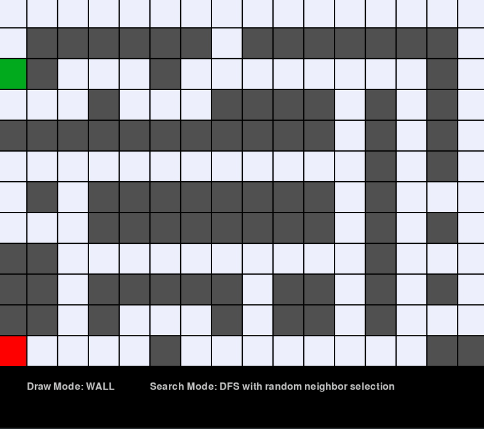

### Maze Solver
---
A maze solver program written with pygame and Python. 



#### Installation
```bash
git clone <repository_URL>
pip install -r requirements.txt
python ./main.py
```

#### Basic Usage
- Draw your own custom maze or use the default maze provided
- Add `START` and `GOAL` cells.
- Choose the path solving algorithm
- Hit the `ENTER` key to solve
- You can save your own custom grid by pressing `Ctrl + S`.

A cell in the maze can be of the following types: 
- `WALL` - Its an obstacle (Color: Greyish)
- `EMPTY` - Its empty (Color: White)
- `START` - Starting position (Color: Red)
- `GOAL` - Goal position (Color: Green) 
- `PATH` - It is the cell which part of the found path (Color: Yellow)

#### Advanced Usage
- Draw your own maze/grid
  - `Left Click` on grid cells to draw. By default, it draws a `WALL` cell.
  - Use the `Q` key to change the draw mode. 
    - Available modes: `WALL`, `EMPTY`, `START`, `GOAL`
  - Use `Ctrl + S` to save the current grid, the saved grid can be found in the `./saves` folder.
  - You can load your saved grid by modifying the parameter `LOAD_GRID_PATH` in `main.py` file.
  - Press the `C` key to clear the grid
- Solving the grid
  - Press the `ENTER` key to display the solution path found by the selected algorithm.
  - You can press the `ENTER` key multiple times which might result in display of different path solutions.
  - Press the `M` key to change the path finding strategy.
    - Available Strategies: `A* Search Algorithm`, `DFS with random neighbor selection` and `DFS with greedy neigbhor selection`
  - Press the `R` key to remove the solution path.

#### Todo
- Show in animated way

#### References
- Lecture 0 - CS50 Introduction to AI with Python 2020 
  - [harvard.edu](https://cs50.harvard.edu/ai/2020/weeks/0/)
  - [YouTube](https://www.youtube.com/watch?v=D5aJNFWsWew)
- [Wikipedia - A* Search Algorithm](https://en.wikipedia.org/wiki/A*_search_algorithm#Pseudocode)